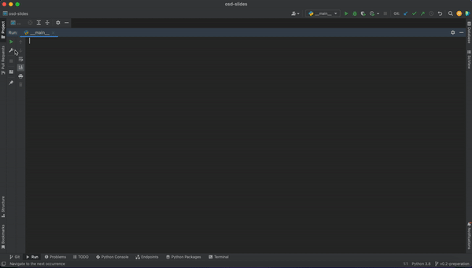

# osd-slides
`osd-slides` is a tool to download Prof. Paine's slides through terminal with one command. 

[](https://github.com/kkarakas/osd-slides)
[](https://opensource.org/licenses/MIT)

[](https://codecov.io/gh/kkarakas/osd-slides)

[](https://pypi.org/project/osd-slides/)
[](https://osd-slides.readthedocs.io/en/latest/)
[](https://kkarakas.github.io/osd-slides/)

## Overview
- Open Software Development classes slides are hard to turn it to a pdf and download and search for keywords. This tool will help students to download slides and search for keywords in slides easily. 
- This tool can be used as a library or run from command line. 


## Features
- Read what slides are available
- Download osd slides.
- Search for keywords in the slides.
## Install
```sh
pip install osd-slides
```
## Dependencies
- Uses [Decktape](https://github.com/astefanutti/decktape)

To install decktape, run in osd-slides.
```sh
$ npm install decktape
```
You will need node.js on your computer for above to run.
Check if node.js in your computer by running this. And then check the version of npm.
You might want to restart your terminal/powershell after installing node.js.
```sh
$ Node --version
$ npm --version
```

## How to use
Users can download files by calling searchAndDownloadPdf().
```python
import osd-slides
downloader = Downloader()
downloader.searchAndDownloadPdf()
```

Users can view what files can be downloaded by calling showDownloadablePdf()
```python
import osd-slides
downloader = Downloader()
downloader.showDownloadablePdf()
```
Users can search for keywords in slides and open the exact slide the keyword exists.
```python
import osd-slides
url = "https://www.cs.columbia.edu/~paine/4995/lectures/"
search = Search(url, ["22-legal.html","21-econ.html"])
search.lookup("Legal")
search.open(1)
```
## Example

As said above users can search for keywords in slides and open the exact slide the keyword exists. 
```python
import osd-slides
url = "https://www.cs.columbia.edu/~paine/4995/lectures/"
search = Search(url, ["22-legal.html","21-econ.html"])
search.lookup("Legal")
search.open(1)
```
or running the project from command line like this

```sh
$ python osd-slides/osd_slides/__main__.py search
Which slides would you like to search in? Please provide slides with spaces between them: 
>> 22-legal.html 21-econ.html
Slides reading completed
What keyword would you like to look up: 
>> Legal
Slides that can be found are
[(1, 0, '22-legal.html'), (1, 1, '22-legal.html'), (2, 0, '22-legal.html')]
Which one would you like to open? please provide the number.
>> 2
```
will result in the following:


